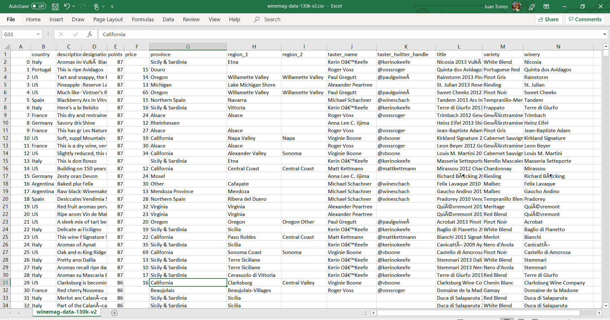
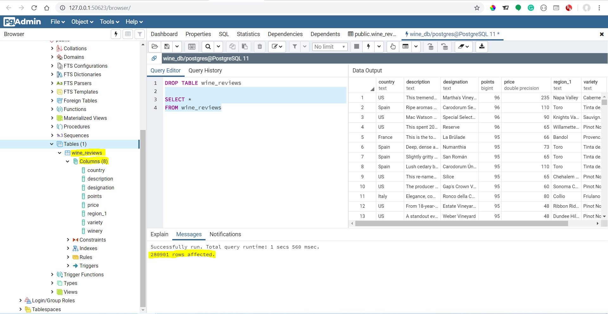

# GlobalWineInc

<h1>Scope</h1>

The scope of this project was to perform a ETL (extract, transform, and load) process, using everything we have in our toolbelt.

<h2>Data Source</h2>
<ol>
  <li>The source of our data was https://www.kaggle.com/zynicide/wine-reviews</li> 
  <li>This site provided the following file scrapped from https://www.winemag.com/?s=&drink_type=wine</li>
</ol>  

<h2>Files:</h2>
<ol>
  <li><a href="https://github.com/juanptl1981/GlobalWineInc/blob/master/wine-reviews/winemag-data-130k-v2.csv">winemag-data-130k-       v2.csv</a></li>
  
  <li><a href="https://github.com/juanptl1981/GlobalWineInc/blob/master/wine-reviews/winemag-data_first150k.csv">winemag-data_first150k.csv</li> 
    
</ol>

<h2>Data Analytics Swiss Army knife:</h2>
<ol>
  <li>Github</li>
  <li>Gitbash</li>
  <li>Jupyter Notebook</li>
  <li>Python</li>
  <li>pgadmin4</li>
  <li>SQL</li>
  <li>CSV Files</li>
  <li>Google Chrome</li>  
</ol>

<h2>Extract</h2>

This project had no extraction using neither API calls or WEB scrapping. But we did use a site called kaggle that had the csv files used in this project. 

<h2>Transform</h2>

In order to be able to transform our data sets we had to create a jupyter notebook and import the follwing modules: 
<ol>
  <li>import pandas as pd</li>
  <li>from sqlalchemy import create_engine</li>
  <li>import psycopg2</li> 
 </ol>

Using the pandas module we create a handle with the csv file and created a dataframe in order to be able to work with the data. 

Then we did a .info on the dataframe to see how we needed to work with the data, and determine how to proceed to clean the data. In this process we found that we needed to replace missing data with "zeros" and "unknowns" in order to have all columns data with same number of entries. Reviews that all columns had their correspondent format (int64, object, float64). For this we used the following code: 
<ol>
  <li>To fill blanks with "Unknown":df['column']=df['column'].fillna('Unknown')</li>
  <li>To fill blanks with "0":df['column']=df['column'].fillna('0')</li>
</ol>

after the previous process, we identified that both datasets had different number of columns; so we decided to drop the ones that where not common and leave both datasets with the follwing structure:

<h3>Data Structure</h3>
<ul>
  <li>country</li>
  <li>description</li>
  <li>designation</li>
  <li>points</li>
  <li>price</li>
  <li>region_1</li>
  <li>variety</li>
  <li>winery</li>
 </ul>
 
Again we we did a .info on the dataframe to see if everything entry had the same count in order to start the loading process. 

Yup... Everything look Great... Let's begin our loading process!!!

<h2>Load</h2>

For this final phase we had to create an engine using the Import psycopg2 module in order to connect and push the dataframe postgres database. After this, we just run a engine.tbale_names() to see if the table was created. And what you think? Yei!!! it is there. 

<h2>Extra Step</h2>

For this project both students worked on their own laptops and created their own jupyter notebooks. So in order to consolidate everything in one, we had to pip install nbmerge and then run the following code in order to merege both files (nbmerge file_1.ipynb file_2.ipynb file_3.ipynb > merged.ipynb) 

for more information on how to merge two jupyter notebook click the following Link...
<li><a href="http://nbmerge.falsifiable.com/">www.nbmerge.com</a></li>

